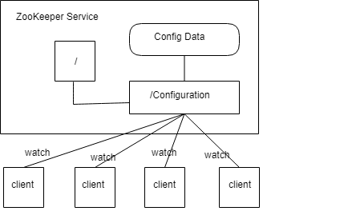
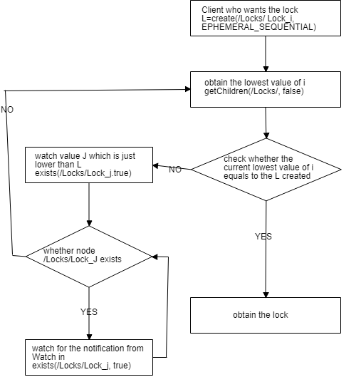
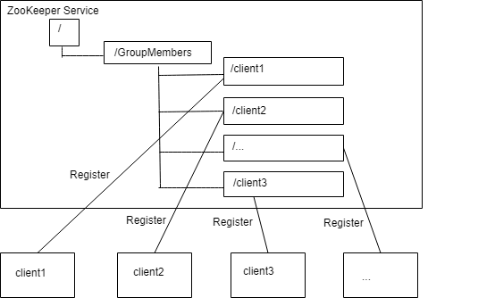

# ZooKeeper: functions

### Maintaining configuration information

**Function:** 

Correctly alter the configuration information of all machines. 

**Approach:** 

1. create a znode/configuration

2. other nodes listen for the change of data on this znode/configuration

3. obtain the data on znode/configuration once data is changed

### Naming Service

**Approach:** 

Provide naming service based on the uniqueness of the path. 

### Distributed Synchronization

**Function:** 

1. Keep exclusive. Consider a znode in ZooKeeper as a lock, implemented by "createznode". All clients try to create node /distribute\_lock, and the client which finally succeeds in creating the node obtain the lock. The node /distribute\_lock is deleted after use, hereby the lock is released. 
2. Control timing. When node /distribute\_lock already exists, all clients create temporary sequential numbered directory node. The client with minimum number obtains the lock, and deletes the node after use. 

**Approach:**

### Group Services

**Function:**

1. Notice whether there's machines join or exit: every client creates temporary directory node under node /GroupMembers; node is added when a machine enters, and the node is deleted when the corresponding machine exits.  
2. Leader election.

**Approach:** 

